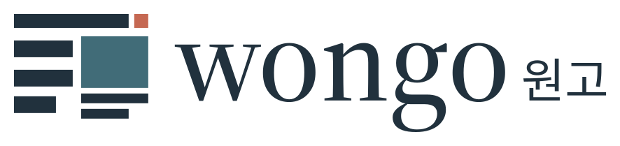
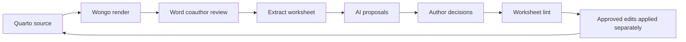

# KIST AIX presentation outline

<picture>
  <source media="(prefers-color-scheme: dark)" srcset="../../brand/logos/wongo-lockup-reverse.svg">
  
</picture>

**Project:** Wongo (원고) — verified tools for LLM-assisted manuscript review

**Presenter:** Hoo Hugo Kim, Center for Water Cycle Research, KIST

**Visual system:** [Wongo identity v1.0](../../brand/README.md), with canonical
[tokens](../../brand/tokens.json) and a [visual specimen](../../brand/design-system.html).
Use white paper, ink `#21313D` for text, petrol `#416C78` for primary emphasis,
and surface `#F3F5F5` for code or evidence panels. Reserve annotation `#C56852`
for a small accent, not body text or a failure label. Source Serif 4 headings,
Source Sans 3 body text, Noto Sans KR Korean text, and Source Code Pro commands
follow the bundled type system.

Keep the manuscript-grid lockup on the opening and closing slides, outside
figures and screenshots. Use the supplied reverse artwork on an ink background;
retain its padding and aspect ratio. Use aligned content, square corners, thin
rules and explicit Pass/Review/Action required labels. This is Wongo's project
identity; presenter affiliation does not imply institutional endorsement.

This is a slide-content outline. All numerical results must come from the latest
[generated scorecard](scorecard.md). The MCP work is a development preview.

---

## Slide 1 — Reproducible manuscripts, reviewable AI proposals

Wongo connects Quarto source, Word coauthor edits, and author-approved decisions.

**Speaker note:** Introduce the workflow through a synthetic biofilm manuscript.
The example illustrates software behavior, not validated experimental findings.

---

## Slide 2 — The coordination problem

- Quarto retains source calculations and references.
- Coauthors return Word Track Changes and comments.
- An AI assistant needs source context and explicit boundaries before recommending edits.

**Speaker note:** Missing citekeys and altered generated values are concrete
failure modes that software can help expose. Do not imply that every scientific
error is mechanically detectable or every assistant makes the same mistakes.

---

## Slide 3 — Decisions remain visible



Wongo does not apply worksheet edits to `.qmd`. Proposals and overriding decisions
remain in the worksheet. Source-aware tags identify lines needing closer review;
they do not establish the scientific correctness of a proposed change.

---

## Slide 4 — MCP exposes the existing engine

| Surface | Capabilities |
|:---|:---|
| 12 tools | Status, doctor, scaffold, profile, checks, render, roundtrip, worksheet status/set/batch/lint, diff |
| 3 resource surfaces | Current project status, journal profiles, worksheet contents |
| 3 prompts | Pre-submission audit, coauthor review, revision diff |

The server uses stdio. The benchmark records the negotiated **MCP protocol
version** and the installed **Python SDK version** separately; the SDK's major
number is not a protocol standard. Discovery and schema checks use a real client
connection. Client installation supports Claude Desktop, Cursor, and VS Code.

**Speaker note:** Show the live discovery result. Launch the server in the
manuscript's project directory or supply explicit project paths to tools.

---

## Slide 5 — Checks supply bounded repair evidence

| Injected defect | Expected hint action |
|:---|:---|
| Missing citekey | `add_bibtex` with the missing key |
| Undefined cross-reference | `define_labels` with the orphan label |
| Missing image file | `create_assets` with the missing path |
| Source count exceeding WR's limit | `trim_words` with positive excess words |

The benchmark injects each defect and verifies its returned fields. A hint to
add a reference is not evidence that the referenced work exists. For Water
Research, the final submission count also includes the newly rendered bibliography.

---

## Slide 6 — Read generated values in their source context

The synthetic demo computes the current density in R. Word shows only `12.4`.
The coauthor fixture changes it to “approximately 13.1”.

| Extracted change | Expected source-aware result |
|:---|:---|
| Generated value replacement | `inline-code`, word delta `+1` |
| Four-word methods insertion | No semantic tag, word delta `+4` |

The fixture is built from an actual Quarto/R render and Word tracked edits.
Tagging consults the matched source line. The assistant should propose reviewing
the calculation, not assume the new value or the old value is scientifically right.

**Speaker note:** Open the source line and worksheet together. If source files
changed after extraction, inspect alignment again before applying any edit.

---

## Slide 7 — Proposal, author decision, lint

1. The agent proposes `apply` for the methods clarification and `fix-code` for the generated value.
2. The worksheet remains unresolved until the author confirms or overrides each proposal.
3. Lint checks readiness and source risks before approved edits are applied separately.

A revision diff can produce Word tracked changes; special or unsupported content
must be inspected using the diff report and Word Compare where appropriate.

**Speaker note:** Show the transition from two pending rows to two proposals,
then simulated final decisions. Do not substitute automated test decisions for
approval of a real manuscript.

---

## Slide 8 — What the benchmark measures

| Dimension | Passing evidence |
|:---|:---|
| Discovery | Exact tool/prompt/resource contracts and actual resource/prompt reads over stdio |
| Audit | Clean HARD checks plus four injected defects with expected hints |
| Roundtrip | Exactly two expected edits, source tags/deltas, proposal and decision states, clean final lint, unchanged source |
| Submission refusal | Expected citation GateError; all existing outputs and manifest retain their hashes |

Insert the latest `scorecard.md` results, timestamp, and local timings here before
presentation. Failures remain visible and return a nonzero benchmark exit code.

**Not measured by this harness:** LLM accuracy, hallucination rate, researcher
time savings, scientific validity, journal acceptance, or release-to-release XML
parity. The separate `tools/bytecompare.py` gate measures reference-manuscript parity.

---

## Slide 9 — Synthetic Water Research showcase

- Journal profile: `wr`, research-paper, 8,000-word limit including references.
- Style: `kist-wcr`; collaboration output can carry line numbers.
- Water Research **submission output omits line numbering**, following the profile.
- Main manuscript, separate SI, example figure and table, bibliography, real inline R calculation.

```fish
uv run wongo check --project examples/aix-demo
uv run wongo roundtrip examples/aix-demo/from-coauthors/coauthor-edits.docx --project examples/aix-demo
uv run wongo render --target submission --project examples/aix-demo
```

**Speaker note:** The figure, data and scenario are demonstration material. This
is not a publication-ready account of real KIST experiments.

---

## Slide 10 — Reproduce, then pilot

For this unpublished MCP development checkout:

```fish
uv sync --all-extras
uv run wongo doctor --project examples/aix-demo
uv run python tools/aix_eval.py
```

For the current main-branch engine, the documented source-archive installation is:

```fish
uv tool install https://github.com/hoohugokim/wongo/archive/refs/heads/main.zip
```

The public main archive does not yet include this MCP revision. PyPI publication
is pending; do not advertise `uv tool install wongo` until publication is verified.

Next evaluation: test with real coauthor feedback, record review time and error
rates, and complete the planned Windows workflow smoke test.

[Repository and setup](https://github.com/hoohugokim/wongo) · Hoo Hugo Kim (`hookim@kist.re.kr`).
