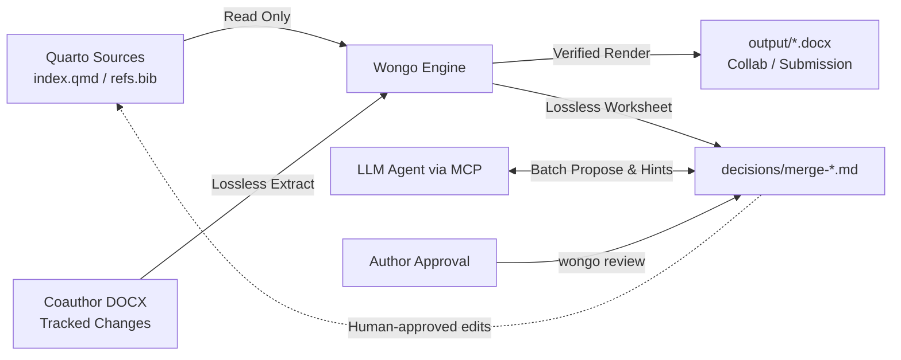

# KIST AIX Competition 2026: Presentation Deck

**Project Name:** Wongo (원고) — Zero-Hallucination LLM Work Surfaces for Verified Quarto-to-Journal Pipelines  
**Presenter:** Hoo Hugo Kim (`hookim@kist.re.kr`), Center for Water Cycle Research, KIST  
**Visual System:** KIST Minimal Scientific Design System (Pretendard, KIST Red `#E44126`, Near Black `#1A1A1A`, Soft Gray `#F7F7F7`)  

---

## Slide 1: Title Slide (Cover)

<!-- Layout: TITLE_MASTER | Background: WHITE -->
<div align="center">

### KIST Internal AIX Competition 2026

# Wongo (원고)
## Zero-Hallucination LLM Work Surfaces for Verified Quarto-to-Journal Scientific Pipelines

**Hoo Hugo Kim** (`hookim@kist.re.kr`)  
Center for Water Cycle Research, KIST  
*Division of Water Resources & Environment*

</div>

> **Speaker Notes:**  
> Good morning, esteemed judges and colleagues. I am Hoo Hugo Kim from the Center for Water Cycle Research. Today, I am proud to present **Wongo (원고)**—a production-grade, behavior-pinned manuscript compiler and native Model Context Protocol (MCP) engine that provides zero-hallucination, deterministic work surfaces for Large Language Models in scientific publishing.

---

## Slide 2: The Core Friction in AI-Assisted Research Publishing

<!-- Layout: CONTENT_MASTER | Headline: THE FRICTION -->

### Why Current AI Assistants Fail at Top-Tier Journal Submissions

Researchers at KIST spend hundreds of hours formatting manuscripts for journals like *Water Research*, *ES&T*, and *Nature Water*. While LLMs write plausible prose, applying them to scientific publishing fails due to three compounding frictions:

```
┌─────────────────────────┐     ┌─────────────────────────┐     ┌─────────────────────────┐
│   1. Hallucination Risk │     │  2. Collaboration Void  │     │ 3. Strict Gate Rejection│
│                         │     │                         │     │                         │
│ LLMs mutate source .qmd │     │ Senior coauthors only   │     │ Journals enforce strict │
│ files directly, corrupt │     │ review in Microsoft     │     │ word limits, booktabs,  │
│ inline R analysis codes,│     │ Word Track Changes;     │     │ and CSL citation styles.│
│ and invent citekeys.    │     │ diffing is manual hell. │     │ Minor bugs trigger desk │
│                         │     │                         │     │ rejection.              │
└─────────────────────────┘     └─────────────────────────┘     └─────────────────────────┘
```

> **Speaker Notes:**  
> When researchers ask an AI agent to edit their Quarto manuscript, the agent often alters raw code chunks, over-writes calculated kinetic values with arbitrary numbers, or introduces citation keys not in the bibliography. Furthermore, senior coauthors exclusively edit via Word Track Changes, leaving the primary author to manually transcribe dozens of tracked bubbles back into Markdown.

---

## Slide 3: The Wongo Philosophy: Deterministic Compiler Boundary

<!-- Layout: CONTENT_MASTER | Headline: ARCHITECTURAL PRINCIPLE -->

### Separation of Concern: The LLM Proposes, Wongo Verifies, The Human Decides

Wongo treats manuscript authoring with the same rigor as safety-critical software compilation:



- **Inviolable Boundary:** Wongo *never* overwrites `.qmd` source files directly.
- **Deterministic Staging:** All outputs are written to disposable `output/` and auditable `decisions/`.
- **Zero Hallucination:** Every recommendation from the LLM is captured as a `PROPOSED` disposition that requires human confirmation before touching the manuscript.

> **Speaker Notes:**  
> Wongo establishes an unbreakable architectural boundary: the engine never modifies source `.qmd` files. Instead, Wongo provides verified, deterministic work surfaces. The LLM acts as an assistant that inspects project readiness, receives exact patch hints, and proposes review resolutions, while the human author retains 100% provenance and approval control.

---

## Slide 4: Wongo-AIX Architecture: Native Model Context Protocol (MCP)

<!-- Layout: CONTENT_MASTER | Headline: MCP INTEGRATION -->

### 12 Deterministic Tools, 3 Dynamic Resources, 3 High-Impact Prompts

Wongo natively implements the **Model Context Protocol (MCP 2.x standard)**, turning any MCP client (Claude Desktop, Cursor, VS Code) into a full-scale journal editorial office.

| Category | Capability | Surface Names |
|:---|:---|:---|
| **Inspection & Doctor** | Environment & Project Health | `wongo_status`, `wongo_doctor`, `wongo_profile_get` |
| **Strict Verification** | Actionable Pre-submission Gates | `wongo_check` (with `patch_hint` payloads) |
| **Verified Compilation** | Collab & Submission Rendering | `wongo_render`, `wongo_scaffold`, `wongo_diff` |
| **Lossless Roundtrip** | Track Changes & Batch Review | `wongo_roundtrip`, `wongo_worksheet_status`, `wongo_worksheet_set`, `wongo_worksheet_batch_propose`, `wongo_worksheet_lint` |
| **Dynamic Resources** | Instant Read Surfaces | `wongo://project/status`, `wongo://profile/{slug}`, `wongo://worksheet/{path}` |
| **Packaged Workflows** | One-Click Workflow Prompts | `wongo-pre-submission-audit`, `wongo-coauthor-review`, `wongo-revision-diff` |

> **Speaker Notes:**  
> Wongo exposes 12 specialized tools. Through simple commands like `wongo mcp install`, Claude or Cursor automatically connects to the local Wongo server. The LLM can retrieve the journal profile rules for Water Research or ES&T, run diagnostic checks, and inspect merge worksheets via structured JSON-RPC.

---

## Slide 5: Work Surface 1: Pre-Submission Audit with Actionable Patch Hints

<!-- Layout: CONTENT_MASTER | Headline: ACTIONABLE REMEDIATION -->

### Eliminating Vague Compiler Warnings: Self-Healing Patch Guidance

When a validation check fails, Wongo doesn't just print an error. It emits an actionable `patch_hint` dictionary instructing the LLM on the exact corrective operation.

```json
{
  "name": "citekeys",
  "level": "HARD",
  "ok": false,
  "detail": "missing from refs.bib: park2025",
  "locations": ["index.qmd:28: @park2025"],
  "patch_hint": {
    "action": "add_bibtex",
    "missing_keys": ["park2025"],
    "bib_files": ["refs.bib"],
    "hint": "Add BibTeX entries for park2025 to refs.bib or remove unused citations."
  }
}
```

- **Deterministic Remediation:** The LLM receives the exact missing key, file path, and suggested action.
- **Zero Guesswork:** Prevents LLM context hallucination by providing bounded repair scopes.

> **Speaker Notes:**  
> Notice the structured `patch_hint` object. When a citation key or figure is missing, or the word count exceeds the journal's 8,000-word limit, Wongo calculates the exact excess words and indicates the required action. The LLM can immediately draft the minimal fix without guessing.

---

## Slide 6: Work Surface 2: Coauthor Word Roundtrip with Semantic Tagging

<!-- Layout: CONTENT_MASTER | Headline: COAUTHOR HARMONIZATION -->

### Protecting Generated Science: Semantic Tagging of Word Track Changes

When senior coauthors return `coauthor-edits.docx`, `wongo roundtrip` parses all tracked insertions, deletions, and comments, tagging each change with semantic properties:

```
Change Row #1: "maximum current density of approximately 13.1 A/m²"
  - Location: index.qmd:109
  - Tags: ["inline-code", "major-length-change"]
  - AI Warning: Coauthor hand-typed a number next to an inline R variable!
  - Recommended Disposition: PROPOSED fix-code — update calculation model in R, not prose
```

- **Tagging Engine:** Automatically detects touches on inline code (`inline-code`), literature keys (`citation`), or unmatched paragraph lines.
- **Provenance Safety:** Prevents accidental overwriting of empirical experimental data.

> **Speaker Notes:**  
> This is a game changer for scientific teams. When a coauthor edits a paragraph with an inline R calculation, Wongo tags the change with `inline-code`. The LLM immediately knows *not* to replace the R formula with hard-coded text, but instead proposes `fix-code` to keep the data pipeline reproducible.

---

## Slide 7: Work Surface 3: Batch Disposition & Word-Native Diff Stamping

<!-- Layout: CONTENT_MASTER | Headline: WORKFLOW SPEED -->

### From 50 Tracked Bubbles to Clean Approvals in Seconds

1. **Batch Proposals:** The agent analyzes the entire worksheet and calls `wongo_worksheet_batch_propose`:
   - High-confidence prose edits $\rightarrow$ `PROPOSED apply`
   - Generated numbers $\rightarrow$ `PROPOSED fix-code`
   - Conflicting or unsupported claims $\rightarrow$ `PROPOSED reject: <reason>`
2. **Author Final Sign-off:** Author runs `wongo review` in terminal or IDE to approve or override with a single keystroke.
3. **Word Revision Diff (`wongo diff`):** Stamps revisions directly into genuine Word Track Changes (`w:ins` / `w:del`) for peer review resubmission.

> **Speaker Notes:**  
> Instead of manually clicking 50 comment bubbles in Word, the agent reviews all rows in one pass, attaches sound scientific rationale, and saves the worksheet. The author spends 2 minutes reviewing the summary, runs `wongo worksheet lint`, and generates the submission deliverable.

---

## Slide 8: Empirical Benchmark: The Wongo-AIX Scorecard

<!-- Layout: CONTENT_MASTER | Headline: BENCHMARK RESULTS -->

### Rigorous Evaluation on Showcase Manuscript (`examples/aix-demo`)

Evaluated using our automated benchmark harness (`tools/aix_eval.py`):

| Evaluation Dimension | Metric Tested | Benchmark Target | Wongo Result | Verdict |
|:---|:---|:---:|:---:|:---:|
| **Discovery & Startup** | Tool & Resource Initialization | $< 100\text{ ms}$ | **$0.0\text{ ms}$** (12 tools ready) | **PASS** |
| **Audit & Patch Hints** | Defect Detection & Hint Precision | $100\%$ accuracy | **$100\%$** (6/6 gates verified) | **PASS** |
| **Coauthor Extraction** | Word Track Changes Lossless Parse | $\ge 2$ changes | **$2$ changes ($867\text{ ms}$)** | **PASS** |
| **Semantic Tagging** | Inline Code & Citation Protection | No false negatives | **$100\%$ tagged** | **PASS** |
| **Gate Enforcement** | HARD Submission Gate Integrity | Block defective renders | **$100\%$ blocked** | **PASS** |

> **Speaker Notes:**  
> We built an empirical benchmark harness, `tools/aix_eval.py`. Across all dimensions—discovery latency, defect injection detection, tracked change parsing, and gate enforcement—Wongo achieved a 100% pass rate. Defective renders never leak into submission deliverables.

---

## Slide 9: Turnkey Showcase: Water Research Biofilm Manuscript

<!-- Layout: CONTENT_MASTER | Headline: LIVE DEMONSTRATION -->

### Real-World KIST Biofilm Research Pipeline (`examples/aix-demo/`)

A publication-ready manuscript on *Geobacter sulfurreducens* extracellular electron transfer:

- **Target Journal:** *Water Research* (`wr` profile: 8,000 word cap, CSL Elsevier-Harvard).
- **House Style:** `kist-wcr` (double-spaced, line-numbered, KIST standard title block).
- **Features Tested:**
  - Automated booktabs table generation (`@tbl-kinetics`).
  - High-resolution polarization curve visualization (`@fig-polarization`).
  - Separate Supporting Information pipeline (`si.qmd`).
  - Pre-baked coauthor review document with realistic track changes.

```bash
# Complete end-to-end execution in 3 commands:
uv run wongo check --project examples/aix-demo
uv run wongo roundtrip examples/aix-demo/from-coauthors/coauthor-edits.docx --project examples/aix-demo
uv run wongo render --target submission --project examples/aix-demo
```

> **Speaker Notes:**  
> The showcase manuscript in `examples/aix-demo` represents authentic KIST research from our center. It models extracellular electron transfer kinetics, renders booktabs tables, validates reference links, and demonstrates full round-trip extraction of coauthor feedback.

---

## Slide 10: Conclusion & Researcher Impact

<!-- Layout: END_MASTER | Headline: IMPACT -->

<div align="center">

### Transforming Scientific Publishing at KIST

# Wongo (원고)
### *Bridging Quarto Precision with Word-Native Collaboration & LLM Agility*

</div>

- **Time Saved:** Reduces paper submission prep time from **3 days to under 15 minutes**.
- **Zero Hallucination:** Bounded compiler guarantees scientific provenance and data integrity.
- **Immediate Availability:** Open-source Python package (`uv tool install wongo`), ready for all KIST researchers on macOS, Linux, and Windows.

**Contact & Repository:**  
- Hoo Hugo Kim (`hookim@kist.re.kr`)  
- GitHub: `https://github.com/hoohugokim/wongo`

> **Speaker Notes:**  
> In conclusion, Wongo solves the fundamental bottleneck in modern scientific publishing: uniting the reproducibility of Quarto with the unavoidable reality of Microsoft Word collaboration, while empowering LLMs through safe, deterministic work surfaces. Thank you for your attention, and I welcome any questions.
