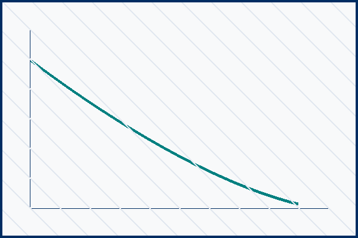

<!-- Synthetic demonstration manuscript; all numerical results are illustrative. -->

```{r}
#| include: false
# Synthetic current (A) divided by electrode area (m²), not experimental data.
demo_peak_density <- 0.00496 / 4e-4
```

## Introduction

Bioelectrochemical systems (BES) have emerged as a versatile platform for sustainable wastewater treatment and renewable resource recovery [@logan2006].
In these systems, electroactive bacteria such as *Geobacter sulfurreducens* couple the oxidation of organic substrates to insoluble terminal electron acceptors [@bond2002].
The rate-limiting step in bioelectrochemical energy conversion frequently resides at the biotic-abiotic interface, where electrons must navigate through conductive biofilm matrices to the solid electrode surface [@kim2024].

Recent investigations have focused on surface chemistry modifications to lower the activation energy barrier for interfacial electron exchange [@park2025].
Chemical grafting of functional groups can tailor the local electrostatic environment, promoting favorable orientation of outer-membrane cytochromes [@smith2023].
However, systematic understanding of how surface charge density interacts with hydrodynamic shear in flow-through bioelectrochemical systems remains incomplete.

In this work, we investigate the interfacial electron transfer kinetics of *G. sulfurreducens* biofilms cultivated on covalently functionalized carbon cloth substrates.
We combine chronoamperometry, cyclic voltammetry, and electrochemical impedance spectroscopy to quantify kinetic rate constants and verify metabolic stability under continuous operating conditions.

## Methods

### Reactor Configuration and Operating Conditions

Dual-chamber bioelectrochemical reactors were constructed using biocompatible polycarbonate blocks with an active liquid volume of 50 mL per chamber.
The anode and cathode compartments were separated by a cation exchange membrane (Nafion 117) pretreated according to standard protocols.
Functionalized carbon cloth (effective geometric surface area: 4.0 cm²) served as the working electrode, while a platinum wire served as the counter electrode.
An Ag/AgCl reference electrode (+0.197 V vs. standard hydrogen electrode) was positioned within 2 mm of the anode surface to minimize uncompensated solution resistance.

Anodic growth medium was continuously supplied at a hydraulic retention time of 2.5 hours using a multichannel peristaltic pump.
The medium contained 20 mM sodium acetate as the sole electron donor, buffered with 50 mM sodium phosphate (pH 7.0), and supplemented with trace minerals and vitamins.
All reactors were maintained in a temperature-controlled incubator at 30 °C.

### Electrochemical Diagnostics

Chronoamperometry was conducted at a poised anode potential of +0.20 V (vs. Ag/AgCl) using a multi-channel potentiostat.
Cyclic voltammetry was performed under turnover (20 mM acetate) and non-turnover (substrate-depleted) conditions at scan rates ranging from 1 to 50 mV/s.
Electrochemical impedance spectroscopy (EIS) was recorded over a frequency range of 100 kHz to 10 mHz with a sinusoidal potential perturbation of 5 mV amplitude.

The relationship between interfacial overpotential $\eta$ and electron transfer current density $j$ was evaluated using the Butler-Volmer formulation:

$$
j = j_0 \left[ \exp\left( \frac{\alpha_a F \eta}{R T} \right) - \exp\left( -\frac{\alpha_c F \eta}{R T} \right) \right]
$$ {#eq-butler-volmer}

where $j_0$ denotes the exchange current density, $\alpha_a$ and $\alpha_c$ represent the anodic and cathodic transfer coefficients, $F$ is the Faraday constant, $R$ is the universal gas constant, and $T$ is absolute temperature.

## Results and Discussion

### Biofilm Growth and Polarization Performance

Inoculation with *G. sulfurreducens* resulted in rapid current generation on the functionalized carbon cloth anodes.
Within 72 hours of inoculation, the biofilm reached steady-state current production.
Polarization curves recorded across varying external resistances revealed distinct operational regimes, as illustrated in @fig-polarization.

{#fig-polarization}

As evidenced in @fig-polarization, the functionalized anode exhibited substantially reduced internal resistance, yielding a maximum power density of 1.85 W/m² compared to 0.77 W/m² for the unmodified control.
The enhanced power output correlates directly with the rapid onset of activation kinetics observed in the low-overpotential region.

### Interfacial Charge Transfer Kinetics

To dissect the fundamental kinetic parameters governing electron exchange, impedance spectra were fitted to an equivalent electrical circuit comprising solution resistance ($R_s$), biofilm capacitance ($C_{dl}$), and charge-transfer resistance ($R_{ct}$).
The resulting kinetic parameters are summarized in @tbl-kinetics.

| Parameter | Unmodified Control | Amine-Functionalized | Units |
|:---|:---:|:---:|:---:|
| Exchange current density ($j_0$) | 0.42 | 1.18 | A/m² |
| Charge-transfer resistance ($R_{ct}$) | 185.4 | 59.2 | $\Omega\cdot\text{cm}^2$ |
| Apparent transfer coefficient ($\alpha$) | 0.48 | 0.52 | — |
| Maximum current density ($j_{max}$) | 5.2 | 12.4 | A/m² |

: Measured electrochemical kinetic parameters for Geobacter sulfurreducens biofilms on test anodes. {#tbl-kinetics}

The kinetic data presented in @tbl-kinetics demonstrate that amine functionalization yields a near threefold elevation in exchange current density ($j_0$).
The corresponding drop in $R_{ct}$ reflects accelerated charge transfer through terminal cytochrome complexes at the biofilm-substrate boundary.
These observations align with previous spectroscopic reports indicating that positively charged surface sites facilitate intimate contact with negatively charged outer-membrane decaheme cytochromes [@smith2023].

## Conclusion

This study demonstrates that targeted surface functionalization of carbon cloth anodes substantially enhances extracellular electron transfer kinetics in *G. sulfurreducens* biofilms.
Under continuous flow conditions, functionalized electrodes sustained a peak current density of `r sprintf("%.1f", demo_peak_density)` A/m² with a marked reduction in interfacial charge-transfer resistance.
These quantitative insights provide actionable design criteria for scaling bioelectrochemical reactors in practical wastewater treatment and resource recovery applications.

::: {#refs}
:::
